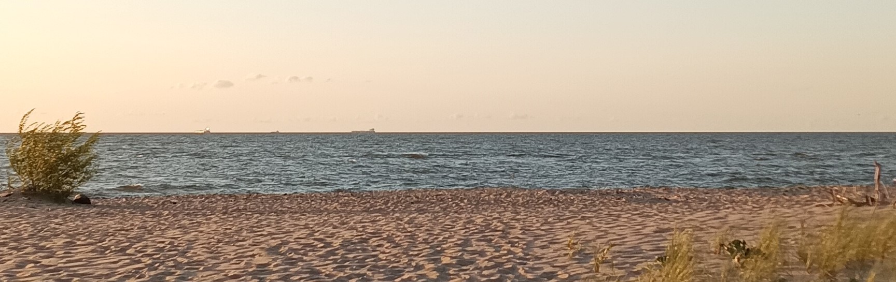

# Olga Kapichenka

## Contact information:
#### Phone: +48 795760636
#### GitHub: [Volha2508](https://github.com/Volha2508)

## About Myself:
#### 2004 - 2020 teacher https://dl.gsu.by/
#### 2020 - 2021 teacher http://gim56.by/

## Skills:
#### Basic: HTML, CSS, c++;
#### course author: https://stepik.org/course/59092/syllabus

## Code Examples:
#### Complete the square sum function so that it squares each number passed into it and then sums the results together.
```javascript
function squareSum(numbers){
  return numbers.reduce((res, x) => res + x**2, 0);
}
```
## Education:
#### [Francisk Skorina Gomel State University 2000-2005](https://www.gsu.by/en/university) 

## Languages:
####  Belarusian, English (basic), Polish(basic)